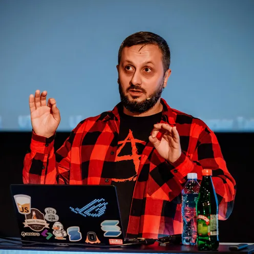

---
# You can also start simply with 'default'
theme: dracula
title: Build you a metaframework in 30 minutes or less
  apply unocss classes to the current slide
class: text-center
transition: slide-left
mdc: true
---

# Build you a **Metaframework** in _30 minutes_ or less

  <carbon:link /> https://darko.io

---
title: Build you a metaframework in 30 minutes or less
  apply unocss classes to the current slide
layout: center
---

# > whoami

- 🧑‍🌾 **CottageCore** webdev
- 💼 DevRel @ **SuperTokens**
- ❤️ Linux, FOSS, Web Platform, The Open Web...
- 🧙‍♂️ D&D, Gaming, Fantasy

---
src: ./pages/01-intro.md
transition: slide-left
---

---
src: ./pages/02-patches.md
transition: slide-left
---

---
src: ./pages/03-what-are-metaframeworks.md
transition: slide-left
---

---
src: ./pages/04-metaframework-parts.md
transition: slide-left
---

---
src: ./pages/05-components.md
transition: slide-left
---

---
src: ./pages/06-vanilla-vite.md
transition: slide-left
---

---
src: ./pages/07-server-entry.md
transition: slide-left
---

---
src: ./pages/08-client-entry.md
transition: slide-left
---

---
src: ./pages/09-app-component.md
transition: slide-left
---

---
src: ./pages/10-checkpoint-demo.md
transition: slide-left
---

---
src: ./pages/11-fs-router.md
transition: slide-left
---

---
src: ./pages/12-vite-config-fsr.md
transition: slide-left
---

---
src: ./pages/13-app-routes.md
transition: slide-left
---

---
src: ./pages/14-checkpoint-demo-2.md
transition: slide-left
---

---
src: ./pages/15-server-functions.md
transition: slide-left
---

---
src: ./pages/16-final-demo.md
transition: slide-left
---

---
src: ./pages/17-summary.md # Renamed from 16
transition: slide-left
---

---
src: ./pages/18-conclusion.md # Renamed from 17
transition: slide-left
---
